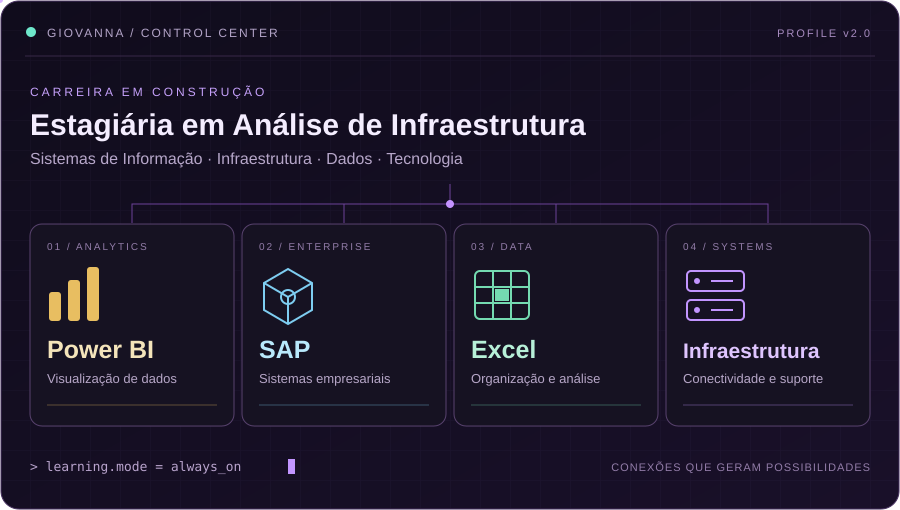

 

### 🪐 GIOVANNA · SYSTEM ONLINE

 

### 💜 Por trás dos sistemas

Sou **Giovanna Souza**, estudante de **Sistemas de Informação** e **estagiária em Análise de Infraestrutura**. Estou construindo minha trajetória na tecnologia, conectando o que aprendo na graduação à experiência profissional.

Entre **infraestrutura, dados e sistemas**, desenvolvo meus conhecimentos em **Power BI, SAP e Excel**. Este espaço acompanha minha evolução: estudos, descobertas e projetos que ganham forma ao longo do caminho.

 

 

✦ Conectando sistemas. Explorando dados. Construindo meu futuro. ✦

